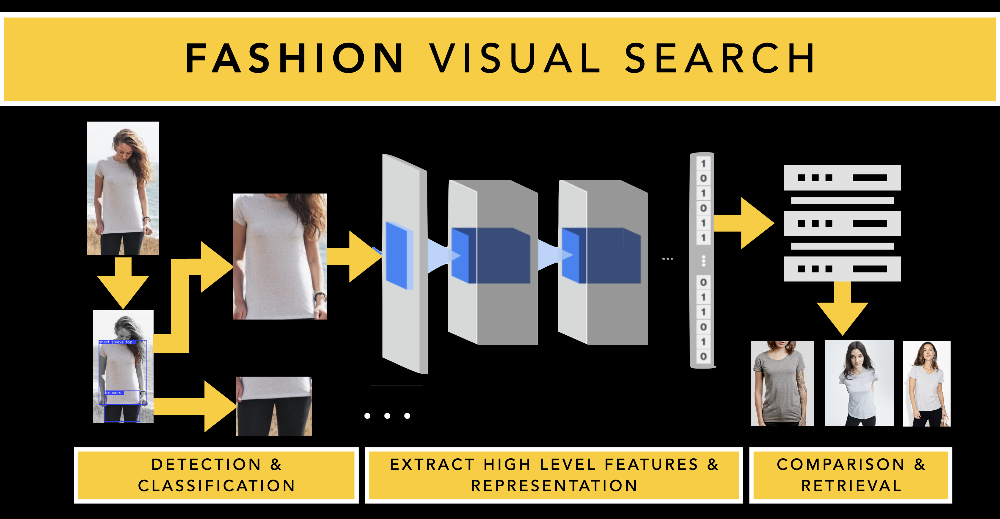

# Fashion Visual Search

## Introduction



The fashion visual search turns customer's inspiration into product discovery by removing the barriers of textual search, using AI to understand the context of images and return a list of related results. It consists of three components. First, it detects and classifies clothing items in the image. It uses Mask R-CNN to do this task. Second, it extracts high-level features and representation of detected clothing items using ResNet architecture. Third, the generated features are compared to the database of features (i.e. database of clothing images) for retrieval.  

## Requirements

- [Python 3.5+](https://www.python.org/)
- [PyTorch 1.0.0+](https://pytorch.org/)
- [TensorFlow 1.13](https://tensorflow.org/)
- [mmcv](https://github.com/open-mmlab/mmcv)


## Installation

```sh
git clone https://github.com/andikarachman/Fashion-Visual-Search
cd Fashion-Visual-Search
pip3 install -r requirements.txt
```

## Model Checkpoint
The following checkpoints shall be downloaded:
- Download the baseline model [here](https://drive.google.com/file/d/1W44KCWEiKFSizDNAFyzQDNO_QU8mUf7J/view?usp=sharing), then put it in `./checkpoint/`.
- Download the detection model [here](https://drive.google.com/file/d/10rGICyPrqx3SH4LswUTuEVldF7cYqMA4/view?usp=sharing), then put it in `./checkpoint/detection/`.
- Download the retrieval model [here](https://drive.google.com/file/d/1GeD92smEevv6Y3-LtVgVA57fOyJX9OhO/view?usp=sharing), then put it in `./checkpoint/retrieval/`.
- Download the landmark model [here](https://drive.google.com/file/d/1OpGrUZB9NfvJGs_JPr24Z8OhrgIw2IT1/view?usp=sharing), then put it in `./checkpoint/landmark/`.

## Reference Images
### Data Structure
For retrieval, the query image will be compared to the reference images. All of the reference images shall be put in `./static/images/data/` folder. I use images from Zalora Indonesia as demo. You can download the reference images that I use for this demo from `./static/images/data/zalora/data-zalora.csv`. The dataset is structured as follow:
```sh
.
├── static
│   ├── images 
│   │   ├── data
│   │   │   ├── zalora
│   ... │   ... ├── Atasan
│       ...     │    ├── Product 1 ID
│               │    │   └── Product1_ID.jpg
│               │    ├── Product 2 ID
│               │    │   └── Product2_ID.jpg
│               │    ├── Product 3 ID 
│               │    │   └── Product3_ID.jpg
│               │    ...
│               ├── Blazer
│               ├── Jeans
│               ├── Dress
│               ├── Hoodies
│               ...
│     
...
```
The dataset hierarchy is described as follow:
- The first level is `zalora`, which is the dataset name.
- The second level is the product categories. 
- The third level is the product ID obtained from `./static/images/data/zalora/data-zalora.csv` file. 
- The fourth level the jpg file corresponding to the product. 

### Generate Embeddings for Reference Images
For quicker retrieval, embeddings for all reference images are generated in advance. To do that, perform the following:
- Generate list of all reference images by running:
```sh
python3 ./references/generate_img_list.py
```
- Generate embeddings by running:
```sh
python3 ./references/generate_embeds.py
```

## Run It With

```sh
python3 app-run.py
```